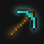
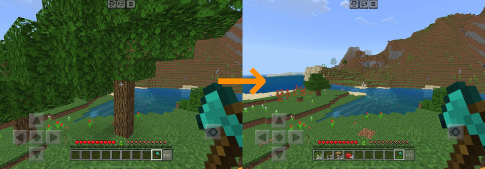
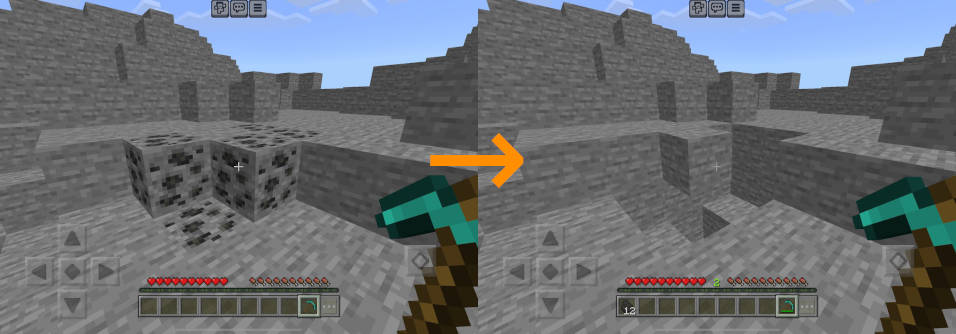
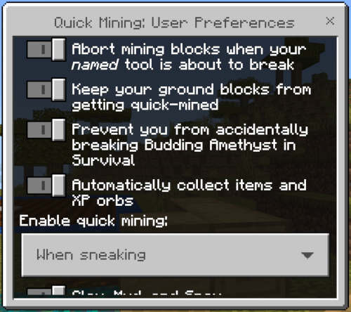

# Quick Mining Addon

This is a Minecraft Bedrock addon for quickly mining ore veins and cutting
the entire trees down. With this addon enabled, when a player mines a
block, all the surrounding blocks with the same type break, which in turn
causes other blocks surrounding them with the same type to break in a chain
reaction.

There are already many similar addons out there, and this is yet another
one joining the party. Why do we need more? What makes it different from
others?

1. **It respects tool enchantments.** Mining ores with *Fortune* pickaxes
   yields more. *Unbreaking* tools last longer. XP-producing blocks like
   Coal ores repair your *Mending* tools. *Silk Touch* may produce
   different kind of items depending on the block type.
2. **It consumes durability of your tools correctly.** Most vein-mining
   addons let you mine the entire vein with consuming durability worth only
   one use of your tool. This addon consumes durability worth one use per
   block you mine, making it less overpowered.
3. **It decays leaves fast.** Cutting logs with an axe also breaks leaves
   immediately, with no additional consumption of tool durability.
4. **It collects items and XP orbs for you.** Items produced by mining
   blocks are directly placed in your inventory. The same goes for XP orbs,
   unless you have damaged *Mending* tools and armors.
5. **It is customizable.** It has a configuration UI to let you customize
   the behavior of the addon, such as when to enable quick-mining, what
   kind of blocks should be quick-mined, and more.
6. **It can coexist with other addons.** Modifying `player.json` is one of
   the greatest ways to make an addon incompatible with others. This addon
   doesn't do anything like that.

# Installation

1. Enable the behavior pack on your world. This automatically enables its
   resource pack counterpart. Enabling it globally is not recommended.
2. Enable **Beta APIs** in the experimental settings for your world.

# Usage

Quick-mining happens when you mine blocks with a suitable tool while
*sneaking*, such as cutting logs with an axe and mining ores with a
pickaxe. You must use a correct tool for your task, that is, cutting trees
with bare hand will not trigger quick-mining.

## Special cases

* **[Log-like blocks](https://minecraft.fandom.com/wiki/Log)**: Cutting
  logs and woods (stripped or not) also breaks non-player-placed leaves
  surrounding them. This is a fast simulation of decaying so your axe don't
  lose durability for this, and its enchantments don't apply. If you want
  to gather leaf blocks, break them with shears or a Silk Touch hoe.
* **[Mangrove trees](https://minecraft.fandom.com/wiki/Mangrove)**: Cutting
  mangrove logs or roots cuts the entire mangrove tree down, including moss
  carpets touching them.
* **[Azalea leaves](https://minecraft.fandom.com/wiki/Azalea_tree)**:
  Breaking azalea leaves (flowering or not) also breaks the other variants.
* **[Huge Mushrooms](https://minecraft.fandom.com/wiki/Huge_mushroom)**:
  Mining mushroom blocks (red or brown) also mines mushroom stems and vice
  versa.
* **[Huge Nether Fungi](https://minecraft.fandom.com/wiki/Huge_fungus)**:
  Mining nether wart blocks (warped or not) also mines surrounding
  shroomlights and vice versa.

# Customization

Type `;qmine prefs` on the chat screen, then close it. A customization UI
will show up. These are per-player settings and do not affect any other
players.

Protection settings:

* **Abort mining blocks when your *named* tool is about to break**: With
  this option enabled, quick-mining will abort or will not trigger when the
  durability of your tool is depleting. This only applies to *named* tools.
* **Keep your ground blocks from getting quick-mined**: This option
  protects blocks underneath the player from being quick-mined. Note it's
  not perfect. The addon does not take account of the type of block you are
  standing on, so you can still accidentally fall down if you are on a
  gravity-affected block such as sand, or one that requires supporting
  blocks like redstone repeater.
* **Prevent you from accidentally breaking Budding Amethyst in Survival**:
  [Budding Amethyst](https://minecraft.fandom.com/wiki/Budding_Amethyst) is
  not eligible for quick-mining in the first place, but this option also
  prevents you from accidentally mining them with or without any
  tools. This doesn't mean a perfect protection. You can still break them
  with [TNT](https://minecraft.fandom.com/wiki/TNT), and
  [Creepers](https://minecraft.fandom.com/wiki/Creeper) don't care the
  option at all. *This option is disabled by default.*

Loots settings:

* **Automatically collect items and XP orbs**: Items produced by mining
  blocks are directly placed in your inventory as long as they
  fit. Overflowed items will be spawned as [item
  entities](https://minecraft.fandom.com/wiki/Item_(entity)) at the same
  location as the player. [Experience
  orbs](https://minecraft.fandom.com/wiki/Experience) go directly into any
  [Mending](https://minecraft.fandom.com/wiki/Mending) equipments until
  they are fully repaired, and excess XP will go into the player.

Quick-mining mode:

* **When sneaking**: Enable quick-mining only when the player is sneaking.
* **When not sneaking**: Enable quick-mining only when the player is not
  sneaking.
* **Always**: Always trigger quick-mining.
* **Never**: Never trigger quick-mining.

Block coverage:

* **Clay, Mud, and Snow**: Enable quick-mining for
  [Clay](https://minecraft.fandom.com/wiki/Clay),
  [Mud](https://minecraft.fandom.com/wiki/Mud), [Snow
  Block](https://minecraft.fandom.com/wiki/Snow_Block), and [Top
  Snow](https://minecraft.fandom.com/wiki/Snow). These require
  [shovels](https://minecraft.fandom.com/wiki/Shovel).
* **Amethyst Buds and Clusters**: Enable quick-mining for [Amethyst
  Buds](https://minecraft.fandom.com/wiki/Amethyst_Cluster) of any size, as
  well as Amethyst Clusters. These require
  [pickaxes](https://minecraft.fandom.com/wiki/Pickaxe) with [Silk
  Touch](https://minecraft.fandom.com/wiki/Silk_Touch).
* **Glowstone and Sea Lantern**: Enable quick-mining for
  [Glowstone](https://minecraft.fandom.com/wiki/Glowstone) and [Sea
  Lantern](https://minecraft.fandom.com/wiki/Sea_Lantern). These require
  pickaxes.
* **Ice, Packed Ice, and Blue Ice**: Enable quick-mining for
  [Ice](https://minecraft.fandom.com/wiki/Ice), [Packed
  Ice](https://minecraft.fandom.com/wiki/Packed_Ice), and [Blue
  Ice](https://minecraft.fandom.com/wiki/Blue_Ice). Ice requires pickaxes
  to quick-mine, and the latter two additionally requires Silk
  Touch. Breaking ice with a non-silk-touch tool will turn it into
  [Water](https://minecraft.fandom.com/wiki/Water) if certain conditions
  are met.
* **Leaves**: Enable quick-mining for
  [Leaves](https://minecraft.fandom.com/wiki/Leaves). They require either
  [Shears](https://minecraft.fandom.com/wiki/Shears) or
  [hoes](https://minecraft.fandom.com/wiki/Hoe).
* **Logs, Woods, Stripped Logs, and Stripped Woods**: Enable quick-mining
  for [log-like blocks](https://minecraft.fandom.com/wiki/Log), including
  the [Nether fungus](https://minecraft.fandom.com/wiki/Huge_fungus)
  variants and [Mangrove
  Roots](https://minecraft.fandom.com/wiki/Mangrove_Roots). These require
  [axes](https://minecraft.fandom.com/wiki/Axe) to quick-mine.
* **Mushroom Blocks and Stems**: Enable quick-mining for [Huge
  Mushrooms](https://minecraft.fandom.com/wiki/Huge_mushroom). They require
  axes to quick-mine.
* **Obsidian and Crying Obsidian**: Enable quick-mining for
  [Obsidian](https://minecraft.fandom.com/wiki/Obsidian) and [Crying
  Obsidian](https://minecraft.fandom.com/wiki/Crying_Obsidian). These
  require pickaxes of at least diamond-tier.
* **Ores**: Enable quick-mining for [Ore
  blocks](https://minecraft.fandom.com/wiki/Ore) as well as [Ancient
  Debris](https://minecraft.fandom.com/wiki/Ancient_Debris) and [Block of
  Raw Iron](https://minecraft.fandom.com/wiki/Block_of_Raw_Iron). They
  require pickaxes of varying tiers. Note that [Gilded
  Blackstone](https://minecraft.fandom.com/wiki/Gilded_Blackstone) does not
  count as ore and are not eligible for quick-mining.
* **Plants and Crops**: Enable quick-mining for several plants and
  crops. Mining crops with a hoe does not consume its durability.
  * [Melon](https://minecraft.fandom.com/wiki/Melon) and
    [Pumpkin](https://minecraft.fandom.com/wiki/Pumpkin) require axes to
    quick-mine.
  * [Nether Wart](https://minecraft.fandom.com/wiki/Nether_Wart) requires
    hoes to quick-mine, not sure if it's a plant though.
  * [Grass and Fern](https://minecraft.fandom.com/wiki/Grass) require eiter
    hoes or shears.
  * [Beetroot](https://minecraft.fandom.com/wiki/Beetroot),
    [Carrot](https://minecraft.fandom.com/wiki/Carrot),
    [Potato](https://minecraft.fandom.com/wiki/Potato), and
    [Wheat](https://minecraft.fandom.com/wiki/Wheat) require hoes.
  * [Glow Lichen](https://minecraft.fandom.com/wiki/Glow_Lichen) and
    [Vines](https://minecraft.fandom.com/wiki/Vines) require shears. Note
    that [Sculk Vein](https://minecraft.fandom.com/wiki/Sculk_Vein) does
    not count as a plant.
* **Non-stone common rocks such as Andesite, Basalt, and Tuff**: Enable
  quick-mining for [Andesite](https://minecraft.fandom.com/wiki/Andesite),
  [Basalt](https://minecraft.fandom.com/wiki/Basalt),
  [Diorite](https://minecraft.fandom.com/wiki/Diorite), and
  [Tuff](https://minecraft.fandom.com/wiki/Tuff). These require pickaxes to
  quick-mine. *This option is disabled by default.*
* **Uncommon rocks such as Blackstone, Calcite, and Magma Block**: Enable
  quick-mining for
  [Blackstone](https://minecraft.fandom.com/wiki/Blackstone), [Block of
  Amethyst](https://minecraft.fandom.com/wiki/Block_of_Amethyst),
  [Calcite](https://minecraft.fandom.com/wiki/Calcite), [Dripstone
  Block](https://minecraft.fandom.com/wiki/Dripstone_Block), and [Magma
  Block](https://minecraft.fandom.com/wiki/Magma_Block). These require
  pickaxes to quick-mine. *This option is disabled by default.*
* **Gravel, Sand, and Red Sand**: Enable quick-mining for
  [Gravel](https://minecraft.fandom.com/wiki/Gravel),
  [Sand](https://minecraft.fandom.com/wiki/Sand), and Red Sand. These
  require shovels to quick-mine. *This option is disabled by default.*
* **Sculk Block, Catalyst, Sensor, Shrieker, and Vein**: Enable
  quick-mining for [Sculk](https://minecraft.fandom.com/wiki/Sculk), [Sculk
  Catalyst](https://minecraft.fandom.com/wiki/Sculk_Catalyst), [Sculk
  Sensor](https://minecraft.fandom.com/wiki/Sculk_Sensor), [Sculk
  Shrieker](https://minecraft.fandom.com/wiki/Sculk_Shrieker), and [Sculk
  Vein](https://minecraft.fandom.com/wiki/Sculk_Vein). These require hoes
  to quick-mine.
* **Soul Sand and Soul Soil**: Enable quick-mining for [Soul
  Sand](https://minecraft.fandom.com/wiki/Soul_Sand) and [Soul
  Soil](https://minecraft.fandom.com/wiki/Soul_Soil). These require shovels
  to quick-mine.
* **Terracotta**: Enable quick-mining for
  [Terracotta](https://minecraft.fandom.com/wiki/Terracotta), colored or
  not, but not including [glazed
  one](https://minecraft.fandom.com/wiki/Glazed_Terracotta). These require
  pickaxes to quick-mine.
* **Crimson and Warped Wart Blocks, and Shroomlight**: Enable quick-mining
  for [Nether Wart
  Block](https://minecraft.fandom.com/wiki/Nether_Wart_Block), Warped Wart
  Block, and
  [Shroomlight](https://minecraft.fandom.com/wiki/Shroomlight). These
  require hoes to quick-mine.

## For server admins

Players with operator privileges can also change worldwide settings by
typing `;qmine admin` on the chat screen.

* **Time budget for quick-mining in milliseconds per tick**: Setting this
  to high values may speed up the process of quick-mining, but can cause
  severe server lags. MCBE addons are single-threaded, that is, addon
  scripts run on the same thread that ticks the server. This means addons
  cannot spend too much time in each game tick, so this addon measures the
  time it's taking and reschedules its remaining work for the next tick if
  it's going to take longer than this value. It is not recommended to
  change this value unless you know what you are doing.
* **Maximum horizontal distance for blocks to quick-mine**, **Maximum
  vertical distance for blocks to quick-mine**: The range of blocks to be
  quick-mined is limited by these values. Setting them to higher values
  would allow players to cause a massive destruction.

# Known issues

* Hanging mangrove propagules aren't auto-collected. This is currently
  unfixable because their drop rate is not known to the community and thus
  we cannot simulate its loot table.
* Quick-mining huge mushrooms with a non-silk-touch axe yields too many
  mushrooms. This happens because we don't know their drop rate accurately.
* Tall variants of [Grass and
  Fern](https://minecraft.fandom.com/wiki/Grass) cannot be quick-mined due
  to the way how they are implemented in the game. That is, replacing their
  upper half with `minecraft:air` causes their lower half to break, and we
  cannot collect loots from their lower halves. The same goes for [tall
  flowers](https://minecraft.fandom.com/wiki/Flower).
* The addon lets players mine many blocks without consuming their
  [Hunger](https://minecraft.fandom.com/wiki/Hunger) value. This is because
  the scripting API is currently not capable of allowing addons to
  manipulate hunger. You might consider it overpowered but you have to live
  with that.
* Custom ores added by add-ons aren't quick-mined. This is because:
  1. There are no standard block tags for ore blocks representing the
     required tool tier,
  2. Loot tables are not accessible from the scripting API, and
  3. The API doesn't provide any means to simulate what would be dropped
     when a block is mined.

In short, these are issues that we can do absolutely nothing about. Ask
Mojang to improve the API if you want these to be fixed.

# Download

See [releases](https://github.com/depressed-pho/quick-mining/releases).

# Release notes

See [NEWS](NEWS.md).

# Tested on

* Minecraft Bedrock 1.20.51, M1 iPad Pro

# Author

PHO

# License

[CC0](https://creativecommons.org/share-your-work/public-domain/cc0/)
“No Rights Reserved”
